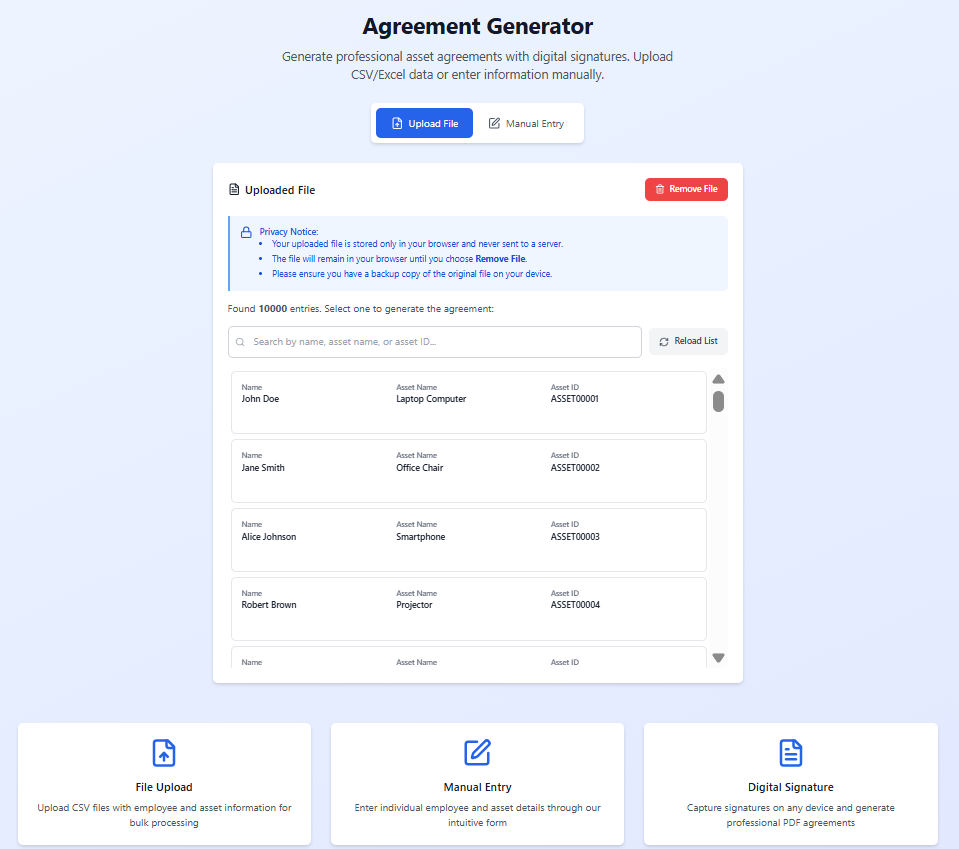

<p align="center">  
  
</p>
<h1 align="center"> Asset Agreement Generator 📑⚡ </h1>

<p align="center">
  A web application to quickly generate professional asset agreements.  
  <br>
  <em>Simple, fast, and reliable — agreements made easy.</em>
</p>

<p align="center">
  <a href="https://asset-agreement-generator.vercel.app/"></a>
  <a href="https://opensource.org/licenses/MIT"></a>
  
</p>

<p align="center">
<a href="#features">Features</a>
<span>&nbsp; • &nbsp;</span>
<a href="#techs">Tech Stack</a>
<span>&nbsp; • &nbsp;</span>
<a href="#started">Getting Started</a>
<span>&nbsp; • &nbsp;</span>
<a href="#team">Team Members</a>
</p>

<h2 id="layout">📸 Preview</h2>

<p align="center">

</p>


<h2 id="features"> ✨ Features </h2>

- 📤 **CSV/XLSX Upload** – Import bulk asset records for agreement generation.  
- 📝 **Form Input** – Enter agreement details manually with validation.  
- 📄 **Preview Mode** – See agreements before exporting.  
- 📑 **PDF Export** – Generate print-ready agreements.  
- ⚡ **Virtualized List Rendering** – Smooth scrolling for large datasets.  
- 🔍 **Search & Filter** – Quickly find and manage uploaded data.  


<h2 id="techs"> 🛠 Tech Stack </h2>

- **Frontend:** React + TypeScript  
- **PDF Generation:** react-pdf  
- **Data Parsing:** Papa Parse (CSV), SheetJS (XLSX)  
- **Virtualization:** react-window  
- **Styling:** Tailwind CSS  
- **Deployment:** Vercel  


<h2 id="started"> 🚀 Getting Started </h2>

### Prerequisites
- [Node.js (>= 18)](https://nodejs.org/en/download)  
- [Git](https://git-scm.com/downloads)  

### Installation

1. Clone the repository  

   ```bash
   git clone https://github.com/Some0ne11/asset-agreements.git
   cd asset-agreement
   ```

2. Install dependencies  

   ```bash
   npm install
   ```

3. Run locally  

   ```bash
   npm run dev
   ```

4. Build for production  

   ```bash
   npm run build
   npm start
   ```

---

<h2 id="team">🤝 Team Members</h2>

<p>Special thanks to all contributors of this project.</p>
<table>
<tr>

<td align="center">
<a href="https://github.com/Some0ne11">
<br>
<sub>
<b>Ammar Danial Abdullah</b>
</sub>
</a>
</td>

</tr>
</table>
